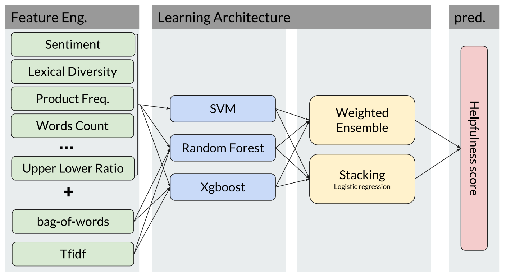

Ranking Reviews Helpfulness
==============================

**The project aims to develop a machine learning approach to automatically rank reviews by their helpfulness**


Dataset
--------
* This dataset consists of fine foods reviews from Amazon.
* The data span a period of more than 10 years, including all
~500,000 reviews up to October 2012.
* Reviews include product and user information, ratings, and a
plaintext review.

<sub><sup>J. McAuley and J. Leskovec. From amateurs to connoisseurs: modeling the evolution of user expertise through online reviews. WWW, 2013</sup></sub>

The Task
------------
Given a set of reviews we want to rank them from the most helpful to the least

There are 11 levels of helpfulness:


Flow Chart
----------




Documentation
------------

Please see  <a href='https://drive.google.com/file/d/1ugqPiowyRqqIluPHLx3DdNd0EqPdrFHF/view?usp=sharing'>Ranking reviews by their helpfulness</a><br>


Project Organization
------------

   
    ├── README.md          <- The top-level README for developers using this project.
    ├── data
    │   ├── interim        <- Intermediate data that has been transformed.
    │   ├── processed      <- The final, canonical data sets for modeling.
    │   └── raw            <- The original, immutable data dump.
    |
    ├── docs               <- The projects documentation
    │
    ├── models             <- Trained and serialized models, model predictions, or model summaries
    │
    ├── notebooks          <- Jupyter notebooks. Naming convention is a number (for ordering),
    │                         and a short  description, e.g. 1.0-pre processing`.
    │
    ├── reports            <- Generated analysis as HTML, PDF, LaTeX, etc.
    │   └── figures        <- Generated graphics and figures to be used in reporting
    │
    ├── requirements.txt   <- The requirements file for reproducing the analysis environment, e.g.
    │                         generated with `pip freeze > requirements.txt`
    │
    ├── setup.py           <- makes project pip installable (pip install -e .) so src can be imported
    ├── src                <- Source code for use in this project.
    │   ├── __init__.py    <- Makes src a Python module
    │   │
    │   ├── data           <- Scripts to download or generate data
    │   │   └── preprocess_dataset.py
    │   │
    │   ├── features       <- Scripts to turn raw data into features for modeling
    │   │   └── build_features.py
    |   |   └── features_selection.py
    │   │
    │   ├── models         <- Scripts to train models and then use trained models to make
    │   │   │                 predictions
    │   │   ├── train_and_predict.py
    │   │   └── ensemble_and_stacking.py
    │   │   └── evaluation.py
    │   │
    │
<sub><sup> Licence: <a target="_blank" href="https://drivendata.github.io/cookiecutter-data-science/">cookiecutter data science project template</a>  </sup></sub>

Instructions
------------
* Project 
<a href='https://bitbucket.org/talazaria/ranking_reviews_helpfulness/src/master/requirements.txt'>dependencies</a><br>
* Installation can be done by:
```commandline
pip install -r requierments.txt
```


Usage
------------
* To train and predict reviews helpfulness, run:
```commandline
cd src
python rank_reviews_helpfulness_flow.py --config_file src/models/config_file.json
```
